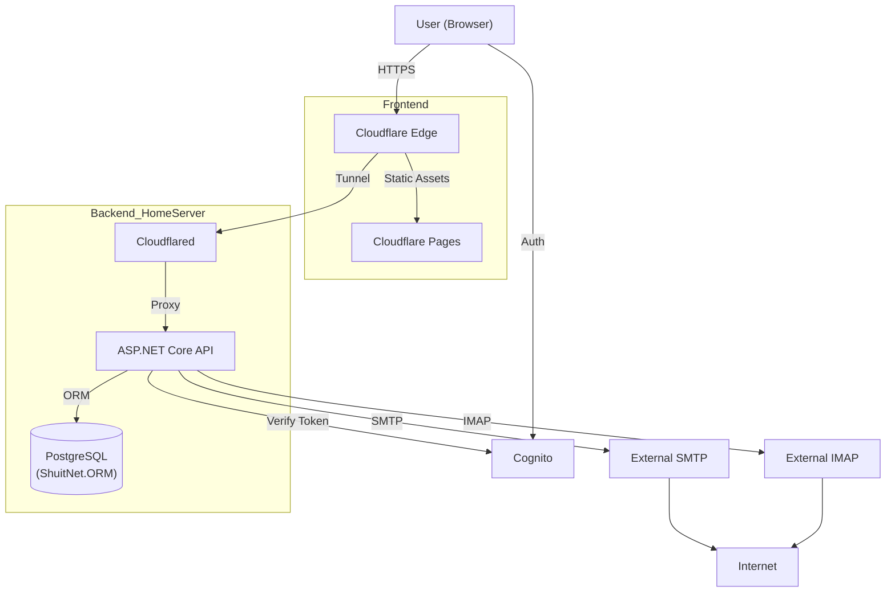

# MailDeck 要件定義書

## 1. プロジェクト概要
**MailDeck**は、単一のAWS Cognitoアカウントで認証し、既存の複数のメールアカウント（外部IMAP/SMTP）を統合管理できるWebメールプラットフォームです。ユーザーは独自のIMAP/SMTPサーバー設定を追加し、ブラウザ上でメールの送受信を一元的に行えます。

### 1.1 背景・目的
*   **一元管理**: 複数のメールサーバー（例: Gmail, Outlook, 自社メールサーバー等）のアカウントを一つのWeb画面で管理する。
*   **柔軟性**: 独自のDNSやメールインフラを持つユーザーが、その既存インフラ（IMAP/SMTP）をそのまま利用できる。
*   **スケーラビリティ**: 認証やユーザー設定の保存にはAWSマネージドサービスを利用。

---

## 2. システム構成概要 (Architecture)

### 2.1 技術スタック
*   **Frontend**: React (TypeScript), Tailwind CSS
    *   *Hosting*: **Cloudflare Pages**
*   **Backend**: ASP.NET Core Web API (.NET 8/9)
    *   *Hosting*: **Self-Hosted (Home Server) via Cloudflare Tunnel**
    *   *ORM*: **ShuitNet.ORM**
*   **Authentication**: AWS Cognito (User Pool)
*   **Mail Infrastructure**:
    *   *Sending*: External SMTP Servers
    *   *Receiving/Syncing*: External IMAP Servers
*   **Database**:
    *   *RDBMS*: **PostgreSQL**

### 2.2 アーキテクチャ図 (High-Level)

---

## 3. 機能要件 (Functional Requirements)

### 3.1 認証・ユーザー管理 (Authentication)
*   **アプリケーション認証**: AWS Cognitoを利用したサインアップ・サインイン。
*   **メールアカウント設定管理 (Key Feature)**:
    *   ユーザーは「初期サーバー設定」および「追加アカウント設定」を行える。
    *   設定項目: サーバーホスト名(IMAP/SMTP), ポート, 暗号化方式(SSL/TLS, STARTTLS), 認証情報(ユーザー名, パスワード)。
    *   **簡単セットアップ (Thunderbird風機能)**:
        *   メールアドレス入力だけで、Mozilla ISPDB (Thunderbird autoconfig) や DNS (SRVレコード/MXレコード) からサーバー設定を自動検出し、手動入力を省略可能にする。
        *   `autoconfig.thunderbird.net` APIなどを利用してサーバーパラメータを自動取得する。
    *   **初期サーバー設定**: ユーザー登録後、または初回利用時にメインで使用するメールサーバー情報を設定するフローを提供。

### 3.2 メール受信・同期 (Receiving & Syncing by IMAP)
*   **フォルダ同期**: IMAPサーバー上のフォルダ構造（Inbox, Sent, Trash等）を取得・表示。
*   **メール一覧**: サーバーからメールヘッダー情報を取得しページネーション表示。
*   **メール本文**: 選択されたメールの本文・添付ファイルをIMAPサーバーからその都度（またはキャッシュから）取得。

### 3.3 メール送信 (Sending by SMTP)
*   **SMTP送信**: 設定されたSMTPサーバー経由でメールを送信。
*   **Fromアドレス選択**: 登録済みの複数のIMAP/SMTP設定から、送信に使用するアカウントを選択可能。

### 3.4 セキュリティ・認証情報管理
*   **認証情報の保護**: 外部メールサーバーのパスワードは、暗号化してデータベースに保存（AWS KMS等を利用して復号可能な状態で保存する必要がある点に留意）。

---

## 4. 非機能要件 (Non-Functional Requirements)

### 4.1 パフォーマンス
*   **IMAP接続の最適化**: 毎回接続するコストを抑えるため、必要に応じて接続プールやキャッシュ戦略を検討（MailKit等のライブラリ活用）。

### 4.2 セキュリティ
*   **通信経路**: Frontend-Backend間はHTTPS。Backend-MailServer間はIMAP over SSL/TLS, SMTP over SSL/TLSを推奨・強制。

---

## 5. データベース設計案 (Concept)

### UserServerConfigs Table
*   `Id` (PK)
*   `UserId` (Cognito Sub)
*   `AccountName` (Display Name)
*   `ImapHost`, `ImapPort`, `ImapUsername`, `ImapPassword` (Encrypted)
*   `SmtpHost`, `SmtpPort`, `SmtpUsername`, `SmtpPassword` (Encrypted)
*   `IsDefault` (初期サーバー/メインアカウントフラグ)
